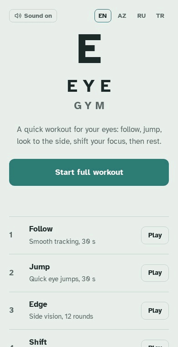

# Eye Gym

A free, browser-based eye exercise game. Five short exercises take about two minutes and turn eye movement practice and screen breaks into something you can actually score and track.

**Play it:** [tosmeley.github.io/EYE_GYM](https://tosmeley.github.io/EYE_GYM/)




## Exercises

| Exercise | What you practise | What is measured |
|---|---|---|
| **Follow** | Smoothly tracking a moving dot | % of time on the dot |
| **Jump** | Quick, accurate eye jumps between targets | Hits, misses, average reaction time (ms) |
| **Edge** | Noticing a flashed letter E while looking at the centre | Correct answers, shortest flash caught (ms) |
| **Shift** | Switching focus between your thumb and a far object, guided by tones | Focus switches completed |
| **Rest** | Looking about 6 m away and blinking slowly, guided by tones | Seconds off the screen |

## Features

- **Full workout and quick break:** a 2-minute routine of all five exercises, or a 45-second near-far and rest break.
- **Extra modes:** Endless Jump (play until you miss 3) and a Daily Challenge with the same target sequence for every player that day.
- **Progress tracking:** streaks, a chart of recent scores, comparison with your first result, daily off-screen time and 10 badges.
- **Adaptive difficulty:** Jump speeds up as you hit targets, and Edge shortens the flash when you answer correctly.
- **Four languages:** English, Azerbaijani, Russian and Turkish, detected automatically with a manual switch.
- **Installable and offline:** a Progressive Web App that can be added to the home screen and works without internet after the first visit.
- **Works everywhere:** mouse, keyboard and touch, with larger targets on touch screens, plus light and dark themes.
- **Private by design:** no accounts and no backend. All progress is stored on the player's own device.

## Tech

- Plain HTML, CSS and JavaScript in a single file, with no frameworks or build step
- HTML5 Canvas for rendering, sized for high-resolution screens
- Web Audio API for the tones used as eyes-off-screen cues
- Web App Manifest and a Service Worker for installing and offline use
- `localStorage` for history, streaks, badges and settings
- Seeded random generator for the shared Daily Challenge
- Optional, cookie-free visitor stats with GoatCounter

## Run locally

Open `index.html` in any browser to play. Install and offline mode need the page served over HTTPS or from localhost, for example:

```
python -m http.server 8000
```

then open http://localhost:8000.

## Files

```
index.html            the game
manifest.webmanifest  app name, icons and colours for installing
sw.js                 service worker for offline use
icons/                app icons
```

## Disclaimer

Eye Gym is for relaxation and practice. It does not diagnose or treat any vision problem, and scores reflect how you played, not how well you see. If you have eye pain, double vision or sudden changes in sight, see an eye doctor.

## Author

Tariyel Mansimov
